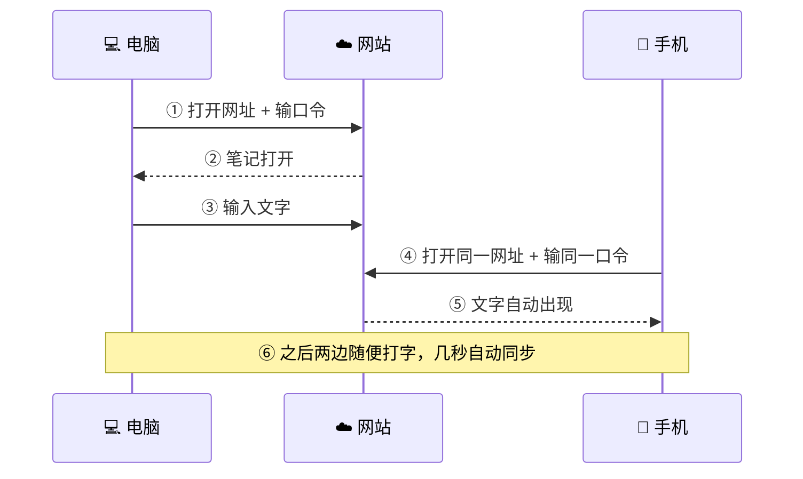
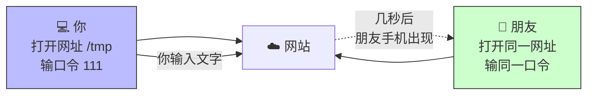
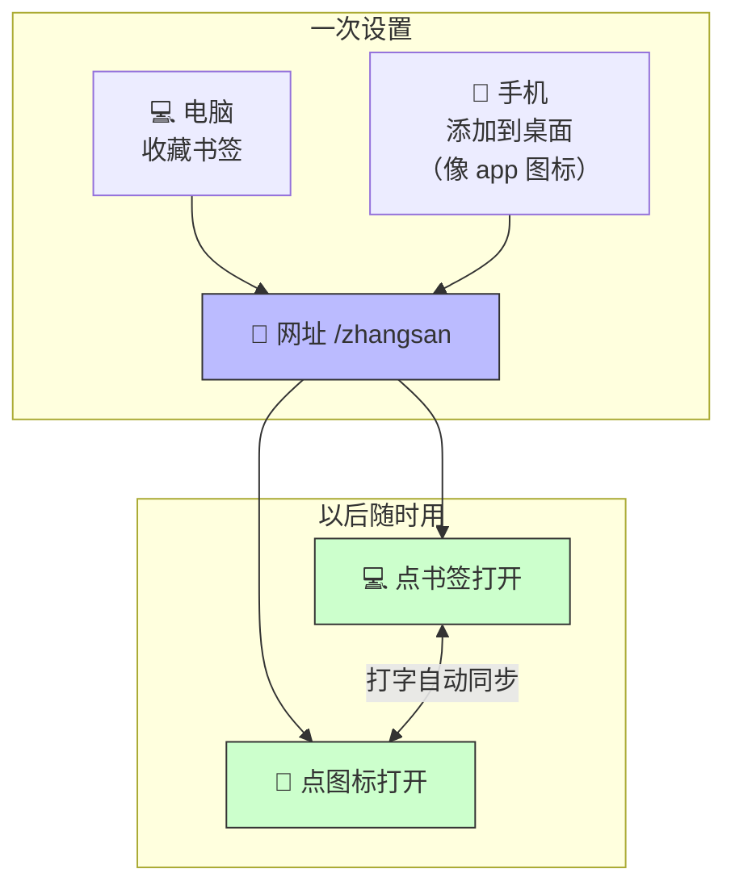
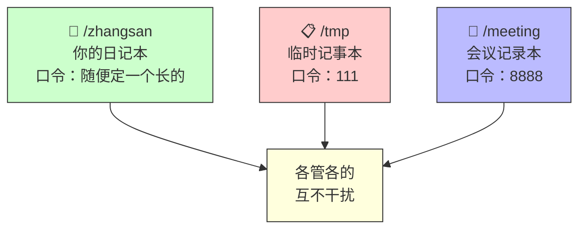
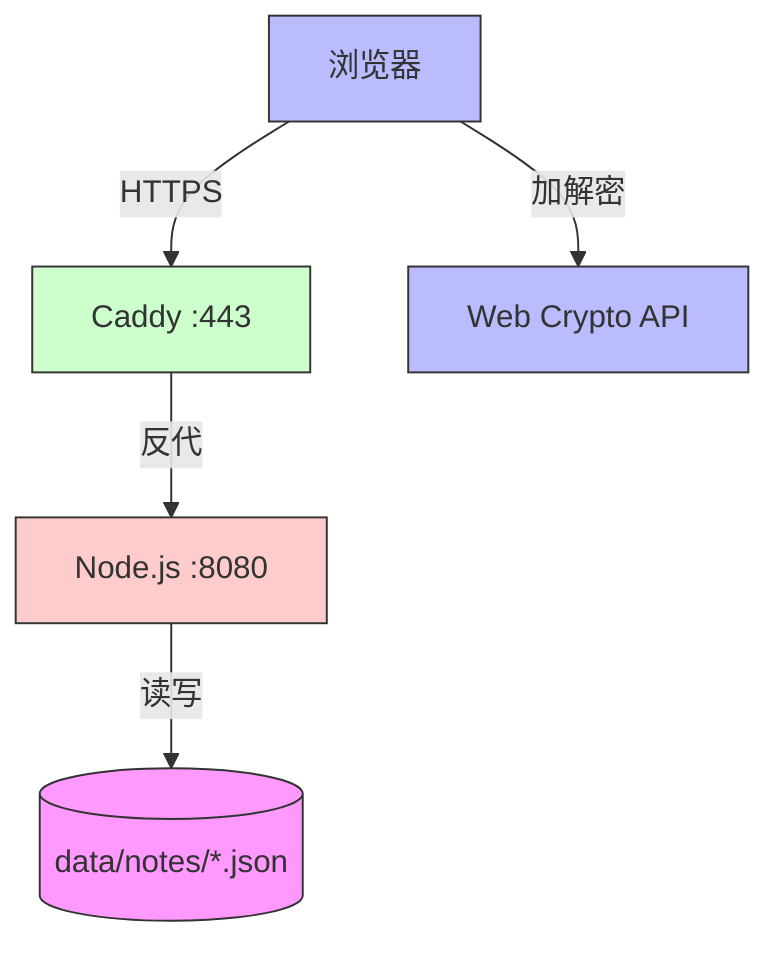
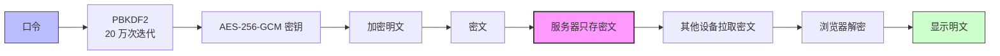

# NoteSync

> 一个极简的端到端加密便签同步工具。多个设备，同一段文字，几秒自动同步。


---

# 📖 第一部分：使用指南

> 普通用户看这一部分就够了。

## 这是什么

我做了一个这样的小工具，用于多个设备自动同步文本。

比如你想要在电脑和手机上同步一段文字。

## 快速开始

**第 1 步**：在 PC 浏览器输入 `https://note.xuyinji.com.cn/xxx`（记为**网址 A**），其中 `xxx` 是任意英文、数字或两者组合。首次访问需要输入一个口令（记为**口令 a**，比如 `12345` 或 `zhangsan`）。

**第 2 步**：在手机浏览器输入**网址 A**，同理手机首次访问也要输入**口令 a**。

**第 3 步**：然后两个设备间输入任何文字或 emoji 表情，自动在几秒内同步。



## 使用场景

### 场景一：临时分享

如果你要在自己设备和别人的设备同步文件，可以随便输入个 URL，比如 `https://note.xuyinji.com.cn/tmp`，然后随便输个口令比如 `111`，用完以后不再使用就行了。



### 场景二：常用笔记

可以设定一个 URL 作为常用的网址，比如 `https://note.xuyinji.com.cn/zhangsan`。然后在 PC 浏览器上保存这个网址，同时在手机浏览器把这个网址保存到手机桌面（看上去像 app 图标一样），以后就可以随时在自己的多个设备之间同步内容。



### 多笔记互不干扰

每个 URL 对应一个唯一的口令，互相完全隔离。你可以按用途创建多个笔记：



> 目前没做口令修改功能。要换口令就新建一个 URL，旧的不管就行。

## 安全说明

### 你的内容只有你能看

口令是端到端加密的——服务器只存密文，加解密全在浏览器完成。所以虽然是我开发的，但我也没法知道你输入的内容。这就是"零知识"设计。

简单说：**你输的口令和文字，从没离开过你的浏览器**。服务器上存的是一堆看不懂的乱码，连我也解不开。

### 防爆破保护

为防止有人拿到你的网址后暴力试口令，系统会自动锁定：

- 同一个设备连续输错口令 **10 次**，这个网址会被锁住 **30 分钟**
- 锁住期间谁也进不去（即使口令对了也不行）
- 所以建议常用笔记用长一点的口令（比如一句话），临时分享用短口令无所谓

---

---

# 🔧 第二部分：技术细节

> 开发者或想自己部署的人看这一部分。

## 技术架构

| 层 | 技术 | 说明 |
|----|------|------|
| 前端 | 原生 HTML/JS | 浏览器 Web Crypto API，无第三方库 |
| 加密 | AES-256-GCM | 对称加密，IV 随机生成 |
| 密钥派生 | PBKDF2 | 20 万次迭代，SHA-256 |
| 后端 | Node.js | 零依赖，单文件 `server.js` |
| 存储 | JSON 文件 | 每笔记独立 `data/notes/{id}.json` |
| 反代 | Caddy | 自动 HTTPS（Let's Encrypt），HTTP/3 |
| 进程管理 | nssm | Windows 服务，开机自启 |



### 加密流程



**关键点**：口令从不离开浏览器，服务器和管理员都看不到明文。

### API

| 方法 | 路径 | 说明 |
|------|------|------|
| GET | `/api/note/:id` | 读取笔记密文 |
| PUT | `/api/note/:id` | 写入笔记密文 |
| POST | `/api/fail/:id` | 上报解密失败（用于限流） |
| GET | `/healthz` | 健康检查 |
| GET | `/*` | 返回前端页面（SPA 路由） |

### 限流机制

- 限流维度：IP + noteId 组合
- 失败阈值：10 次
- 计数窗口：10 分钟（窗口内无新失败则清零）
- 锁定时长：30 分钟（锁定期间连正确口令也拒）
- 存储方式：内存 Map，服务重启清零

## 自部署

### Linux（一键脚本）

```bash
bash install.sh
```

脚本自动安装 Node.js、nginx、certbot，配置 HTTPS 和 systemd 服务。

### Windows（手动）

1. 安装 [Node.js 20+](https://nodejs.org/) 和 [Caddy](https://caddyserver.com/docs/install)
2. 部署 `server.js`、`index.html`、`Caddyfile` 到目标目录
3. 用 [nssm](https://nssm.cc/) 注册 Node 和 Caddy 为 Windows 服务
4. DNS 解析域名到服务器，Caddy 自动申请 HTTPS 证书

### noteId 规则

- 允许字符：`a-z` `A-Z` `0-9` `_` `-`
- 长度：1-32 字符
- 不符合规则的 URL 返回 400

## 限制

- 每个笔记是单文本框，不支持富文本/图片/附件
- last-write-wins 合并策略，同时编辑可能覆盖（4 秒轮询拉取最新版本）
- 限流数据存内存，服务重启清零
- 无口令修改功能（新建 URL 代替）
- 无笔记列表页（知道 URL 才能访问）

## License

MIT
